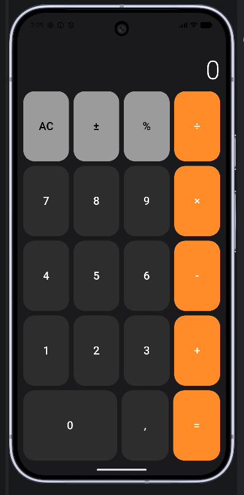
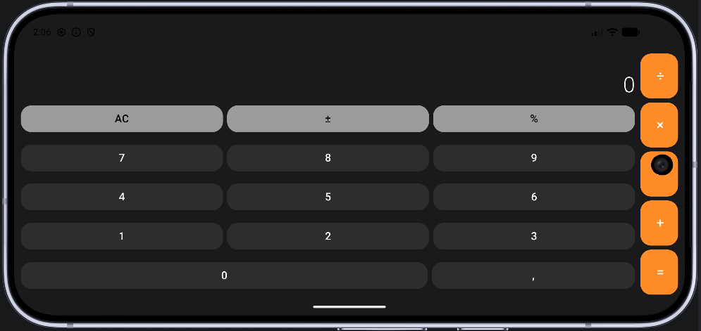

# calculator_compose_by_mimo_AI

calculator compose by MiMo AI.
The calculator was created using MiMo AI.
Xiaomi has released MiMo Code, which is a competitor not only to models, but also to agent systems. Using Visual Studio Code. 
My sequence of actions: 1) created a project inside Android Studio 2) opened it using Visual Studio Code. An AI system was installed inside before.

https://huggingface.co/XiaomiMiMo/MiMo-V2.5-Pro

All the promptings for all the time
========================

--- Session 1 (June 13, 2026) ---

1. How to import mimo Code Into Android Studio
2. Is there any way to configure you in OpenCode
3. I want to create a full-fledged Android application using Android Code, is this possible?
4. How to Integrate Xiaomi MiMo Model (LLM) into an Android application
5. In the AndroidStudioProjects folder, create an Android calculator application and put it in a separate calculator folder, use the latest version of Colin and Kotlin Compose. Open this folder in the Android Studio application.
6. How to install Mimo Code
7. I did what you told me to do and installed the mimo code, now I want to launch the project and see how my Android app works, how do I do this?

--- Session 2 (June 13, 2026) ---

8. Can you launch the project?
9. Now test the project again
10. Build and launch the project
11. Why doesn't the project start and the emulator shut down?
12. Please upload these files to GitHub, which have now been updated. Update the project.
13. Thank you, everything is correct now. Upload the update to GitHub.
14. Upload it to GitHub now.
15. Launch the project
16. The emulator is not running, please launch it
17. please launch the project on the emulator

--- Session 3 (June 13, 2026) ---

18. Launch the project
19. Launch the project on the emulator
20. how to launch an emulator in open code

--- Session 4 (June 13, 2026) ---

21. How long is the free version of mimo code available?

--- Session 5 (June 15, 2026) ---

22. When the screen is rotated, the entire user interface is lost, the buttons are very large. Please correct me.
23. When the screen is rotated, the buttons do not fit on the screen
24. Apply Clean Architecture to the project
25. Can you show me all the promptas that I sent you?

Don't say anything, it's funny. ¯\_(ツ)_/¯
